
<h1>Billingram</h1>

Billingram is a bill generator and customer data managing software made with python.

## Prerequisites

1. Python 3.6 or higher
2. mysql-connector-python library
3. prettytable library
4. mysql server

## Installation

1. Install python 3.6 or higher from [here](https://www.python.org/downloads/).
2. Install mysql server from [here](https://dev.mysql.com/downloads/mysql/).
3. Install mysql-connector-python library by running the following command in terminal:
   `pip install mysql-connector-python`.
4. Install prettytable library by running the following command in terminal:
   `pip install prettytable`.
5. Clone the repository by running the following command in terminal:
   `git clone https://github.com/theAnuragMishra/billingram.git`.
6. Open the `main.py` file in any text editor and change the `host`, `user`, `password` and `database` variables to your mysql server's credentials.
7. Open terminal in the directory where you cloned the repository and run the following command:
   `python billingram_installer.py`
   Enter charset = `latin1` and your mysql username and password when prompted.
8. Billingram is now installed. Run the following command to start the program:
   `python main.py`.

## Usage

### Note: Enter your mysql username and password when prompted

### There are four options available

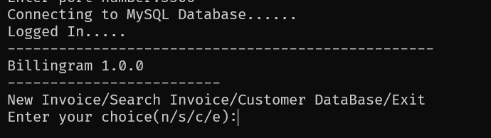

1. New invoice (n)
2. Search invoice (s)
3. View and edit customer data (c)
4. Exit (e)

Let's talk about each one by one.

#### New invoice

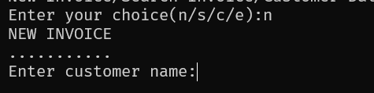

This option is used to generate a new invoice. It asks for the customer's name and phone number.

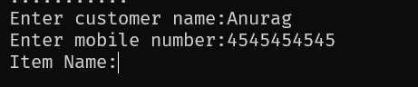

Note: Enter `back` as the customer name to go back to the main menu.

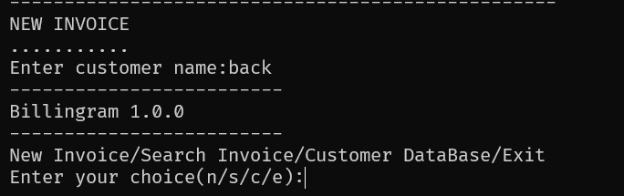

Then it asks for Items, Quantity and Price of each item. After entering all the items, it asks for the discount and then generates the invoice.
It creates a new table in database for each invoice and stores the invoice data in that table. The table name is the invoice number.

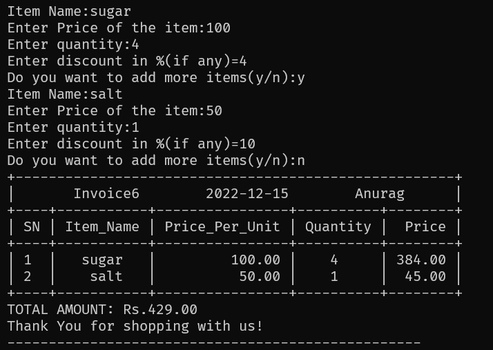

It also stores the customer data in the `customer_data` table and the invoice number and the date in the `invoice_list` table.

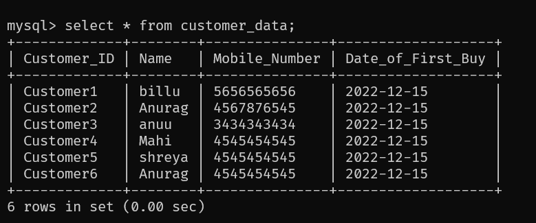

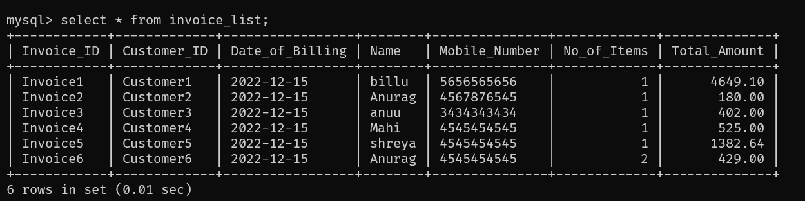

Note: If you enter the same customer name and phone number again, it will not create a new entry in the `customer_data` table. It will just update the total amount spent by that customer.

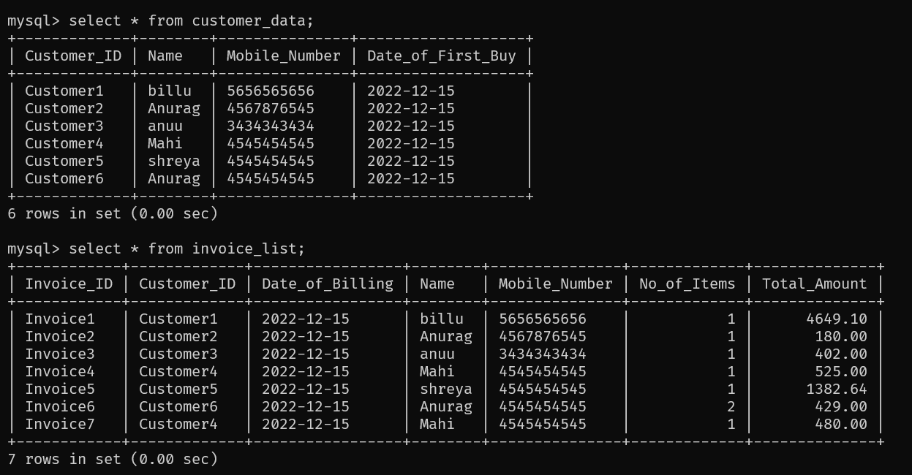

#### Search invoice

There are two options to look for an invoice in the database:

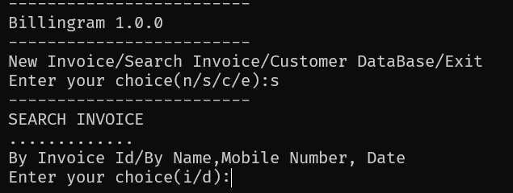

Note: Enter `back` as the invoice number to go back to the main menu.

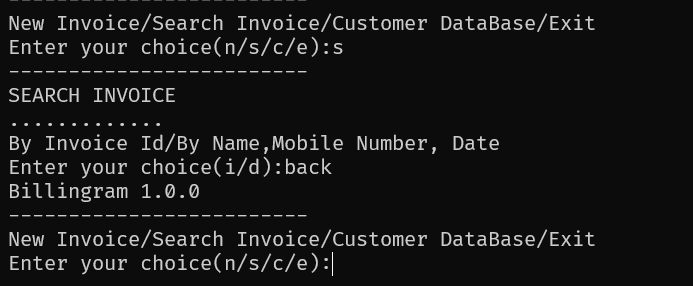

1. Search by invoice number (i)

   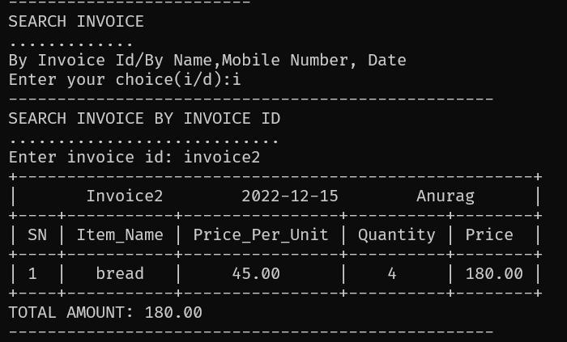

   Note: The invoice number is the name of the table in which the invoice data is stored and is of the format `invoicen` where n is the number of invoice.
   Note: Enter `back` as the invoice number to go back to the previous menu.

   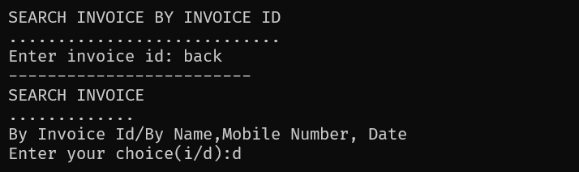

2. Search by customer name, mobile number and date (d)

   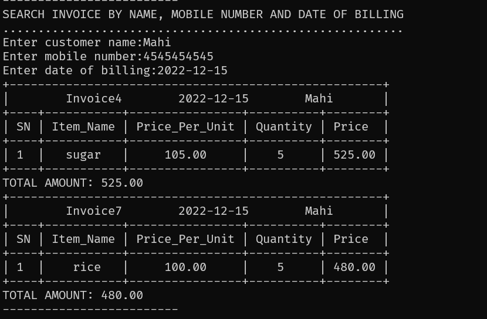

   Note: It displays all the invoices of the customer whose name, mobile number and date you enter.
   Note: Enter `back` as the customer name to go back to the previous menu.

   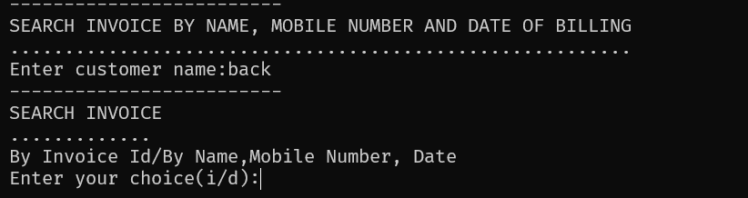

#### View and edit customer data

This option is used to view and edit customer data. It displays the data of the customer whose data you enter.

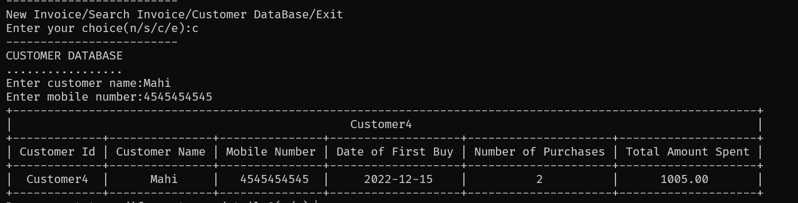

Note: Enter `back` as the customer name to go back to the main menu.

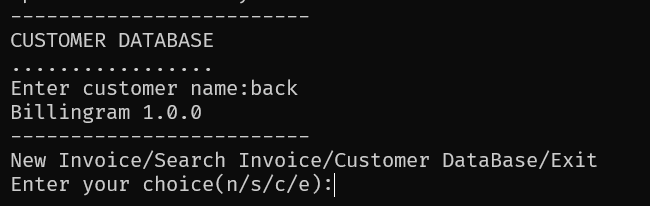

It also gives you an option to edit the customer data.

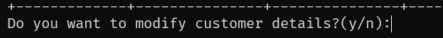

Press "n" to go back to the previous menu without editing. Press "y" to edit the customer data.

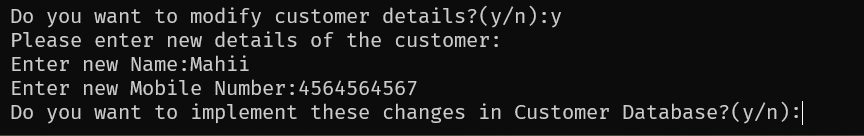

After you're done editing, press "y" to save the changes. Press "n" to discard the changes.

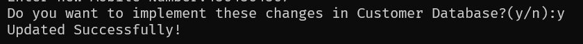

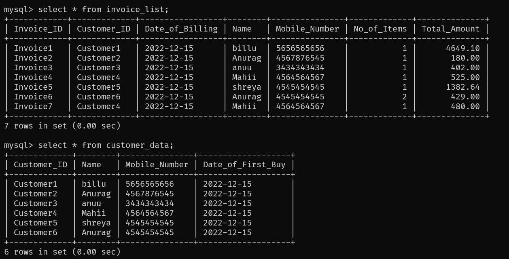

`Mahi` is changed to `Mahii` and `4545454545` is changed to `4564564567` in both the tables, as desired.

## Contributing

To contribute to this project, fork this repository and make a pull request. I will review the changes and merge them if they are good. You can also open an issue if you find any bug or want to suggest a feature. I will try to fix the bug or add the feature as soon as possible.

If you like this project, please star this repository. Thank you. :smile:
